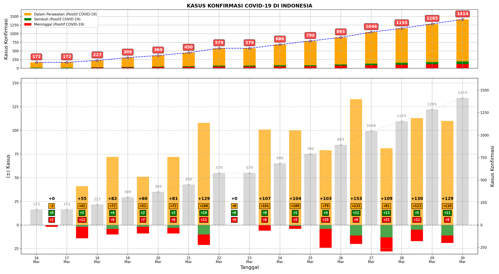
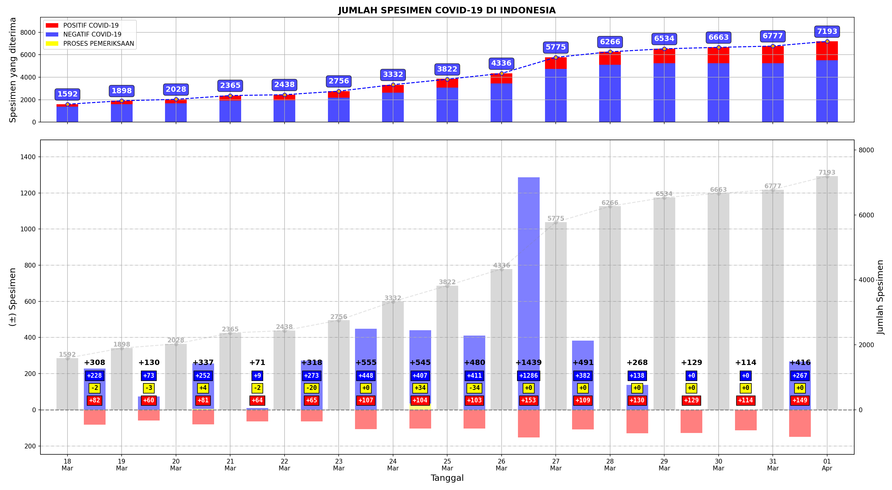

# inkovis


Repo inkovis berisikan modul `inkovis` dan _jupyter notebook_ (buku) yang dapat digunakan untuk memvisualisasikan data infeksi COVID-19 di Indonesia. 

-----

## Contoh Grafik

Contoh grafik menggunakan modul inkovis dengan data 15 hari terakhir (harian):

### Kasus Konfirmasi



### Jumlah Spesimen



-----

## Notebook

Beriku notebook/pos yang menggunakan modul inkovis:

- [[Github: inkovis_nb.ipynb]](https://github.com/taruma/inkovis/blob/master/notebook/inkovis_nb.ipynb). Pada buku ini memvisualisasikan data COVID-19. Buku ini juga meragakan fungsi yang tersedia di modul inkovis. [Lihat buku ini menggunakan NBViewer](https://nbviewer.jupyter.org/github/taruma/inkovis/blob/master/notebook/inkovis_nb.ipynb).
- [[Kaggle: Visualisasi Data COVID-19 di Indonesia]](https://www.kaggle.com/tarumainfo/visualisasi-data-covid-19-indonesia). Visualisasinya menggunakan dataset yang tersedia di kaggle. Pada buku ini juga dijelaskan latar belakang pada pembuatan visualisasinya.
- [[Github: visualisasi_data_covid19_indonesia.ipynb]](https://github.com/taruma/inkovis/blob/master/notebook/visualisasi_data_covid19_indonesia.ipynb). Buku ini serupa dengan Kaggle: Visualisasi Data COVID-19 di Indonesia, yang membedakan hanya dataset dan periode yang digunakan. Dataset menggunakan yang tersedia di repo ini, dan periode yang digunakan adalah 31 hari terakhir. [Lihat buku ini menggunakan NBViewer](https://nbviewer.jupyter.org/github/taruma/inkovis/blob/master/notebook/visualisasi_data_covid19_indonesia.ipynb).
- [Visualisasi Covid-19 di Indonesia](https://taruma.github.io/articles/visualisasi-covid19). Pos yang menampilkan beberapa gambar yang dihasilkan dari notebook `inkovis_nb`.

-----

## Modul inkovis

### Pemasangan

Untuk menggunakan modul inkovis, dibutuhkan dua modul yaitu `inkovis.py` dan `so.py`. `inkovis.py` merupakan modul utama yang berisikan fungsi untuk memvisualisasikan data. `so.py` merupakan modul tambahan yang berisikan fungsi dari orang lain yang digunakan. 

Jika menggunakan jupyter notebook/google colab/kaggle kernel, bisa menggunakan kode berikut: 

```bash
!wget -O inkovis.py "https://github.com/taruma/inkovis/raw/master/notebook/inkovis.py" -q
!wget -O so.py "https://github.com/taruma/inkovis/raw/master/notebook/so.py" -q
```

Atau bisa juga diunduh filenya pada tautan berikut: [inkovis.py](https://github.com/taruma/inkovis/blob/master/notebook/inkovis.py), [so.py](https://github.com/taruma/inkovis/blob/master/notebook/so.py).

### Penggunaan

Fungsi yang tersedia pada modul inkovis meminta input dataset objek `pandas.DataFrame` dan objek `matplotlib.axes.Axes`. DataFrame yang digunakan harus memiliki kolom: `jumlah_periksa`, `konfirmasi`, `sembuh`, `meninggal`, `negatif`, `proses_periksa`. 

Contoh penggunaan:

```python
import inkovis

fig, ax = plt.subplots()

inkovis.plot_confirmed_case(dataset, ax)
```

### Dokumentasi

Untuk saat ini, belum tersedia dokumentasi mengenai penggunaan modul inkovis. 

### Modul `so.py`

Modul inkovis menggunakan potongan kode/fungsi orang lain yang disimpan pada file `so.py`:
- Fungsi `align_yaxis_np()`, [[From Stackoverflow]: Matplotlib axis with two scales shared origin](https://stackoverflow.com/a/46901839/4886384). Menggunakan potongan kode yang disediakan oleh Tim P.

-----

## Dataset

Data diperoleh dari situs Infeksi Emerging oleh Kementerian Kesehatan beralamat [infeksiemerging.kemkes.go.id](https://infeksiemerging.kemkes.go.id/). Dataset tersedia dalam format Excel dan CSV. Dataset diperoleh dari setiap pos yang dipublikasikan pada situs dan mengunduh laporan situasi terkini (yang berupa PDF). Pengisian dataset ini dilakukan secara manual (melihat seluruh dokumen PDF dan mencatatnya ke format Excel, sehingga kekeliruan bisa dapat terjadi). Data disimpan dengan nama dokumen `data_infeksi_covid19_indonesia`. 

Dataset memiliki 9 kolom berupa:

- `tanggal`: Tanggal data dilaporkan (diambil dari informasi "Data dilaporkan sampai [tanggal]" di setiap dokumen situasi terkini).
- `jumlah_periksa`: Jumlah kasus yang telah diperiksa / jumlah spesimen yang diterima.
- `konfirmasi`: Jumlah kasus yang positif COVID-19.
- `sembuh`: Jumlah kasus yang sembuh dari positif COVID-19.
- `meninggal`: Jumlah kasus yang meninggal dari positif COVID-19.
- `negatif`: Jumlah kasus yang negatif COVID-19.
- `proses_periksa`: Jumlah spesimen yang masih dalam proses pemeriksaan.
- `kasus_perawatan`: Jumlah kasus dalam perawatan. Informasi ini tidak/belum tersedia pada dokumen situasi terkini. Informasi ini tersedia sejak tanggal 22 Maret 2020 pada update infografis yang tersedia pada situsnya. 
- `catatan`: Informasi tambahan dari dokumen dan/atau komentar mengenai laporan data. 

Informasi tambahan:

- Jumlah orang yang diambil spesimen dan memenuhi kriteria PDP/ODP/Kontak. (dari laporan situasi terkini 15 Maret 2020). *Informasi ini terkait pengurangan jumlah spesimen.
- Per tanggal 16 Maret 2020, data jumlah orang yang diperiksa hanya data orang yang memenuhi kriteria PDP/ODP/Kontak. Sedangkan pada update sebelumnya, data masih memasukkan orang yang tidak memenuhi tiga kriteria diatas sehingga terjadi pengurangan data jumlah orang yang diperiksa dan jumlah kasus negatif Per tanggal 16 Maret 2020. (dari laporan situasi terkini 16/17 Maret 2020) 

### Catatan mengenai dataset

- Digunakannya nama kolom `konfirmasi` mengikuti infografik yang tersedia di situs infeksi emerging (yang diperbarui per tanggal 22 Maret 2020). Sebelumnya, digunakan nama `positif` dikarenakan pada laporan situasi terkini menggunakan kalimat "Positif COVID-19: ...".
- Kolom `jumlah_periksa` merupakan penjumlahan antara kolom `konfirmasi`, `negatif`, dan `proses_periksa`. `jumlah_periksa == konfirmasi + negatif + proses_periksa`.
- Kolom `kasus_perawatan` merupakan sisa kolom `konfirmasi` yang telah dikurangi oleh `sembuh` dan `meninggal`. `kasus_perawatan == konfirmasi - (sembuh + meninggal)`.
- Informasi `proses_periksa` tidak tersedia sejak 22 Maret 2020.
- Informasi `kasus_perawatan` mulai tersedia pada infografik sejak 22 Maret 2020.
- Istilah "Spesimen Diterima" (yang tertampil pada infografik di situs) nilainya sama dengan "Jumlah orang yang diperiksa". Sehingga, diasumsikan bahwa angka tersebut menyatakan jumlah pengujian yang telah dilakukan.
- Angka yang tersedia pada laporan situasi terkini ditemukan memiliki kekeliruan seperti angka `jumlah_periksa` tidak memiliki nilai yang sama dengan total kolom `konfirmasi`, `negatif`, dan `proses_periksa`. Tetapnya menggunakan informasi dari laporan situasi terkini agar konsisten dan memudahkan dalam memastikan perolehan data. Sehingga, repo ini lebih fokus memvisualisasikan data, dan bukan untuk memvalidasi data ataupun menganalisis data.